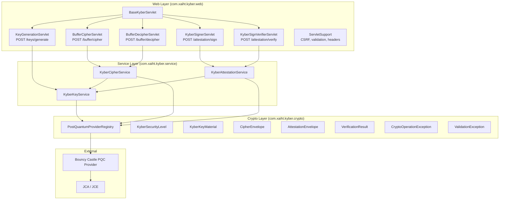
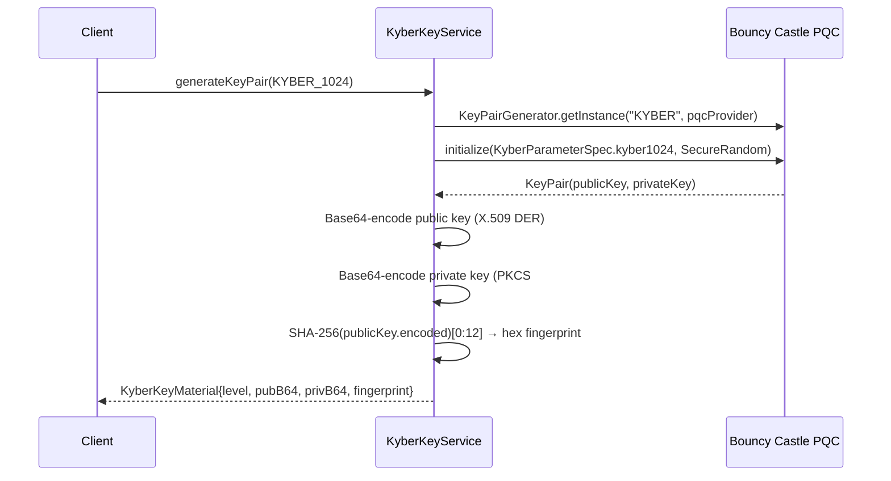
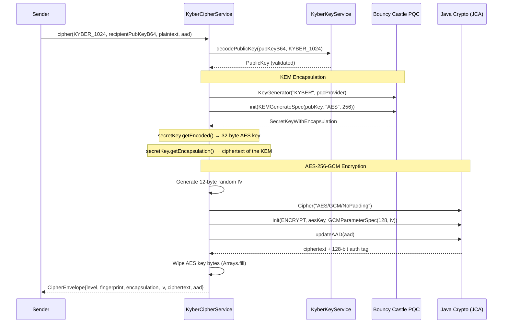
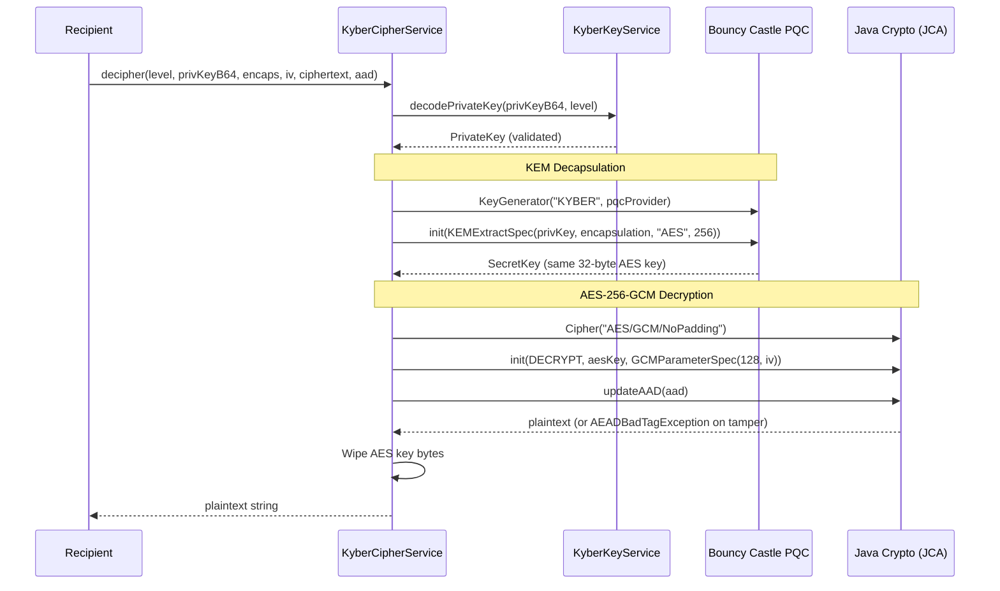
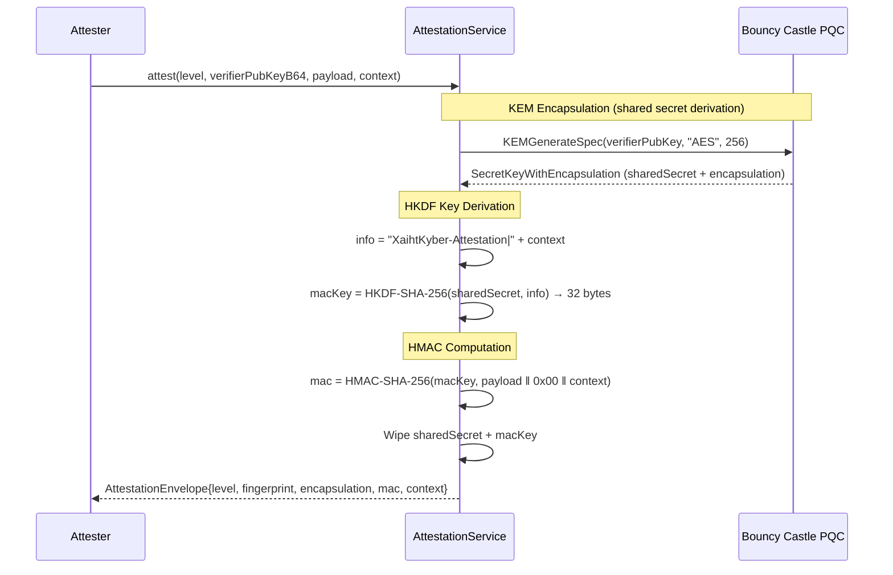
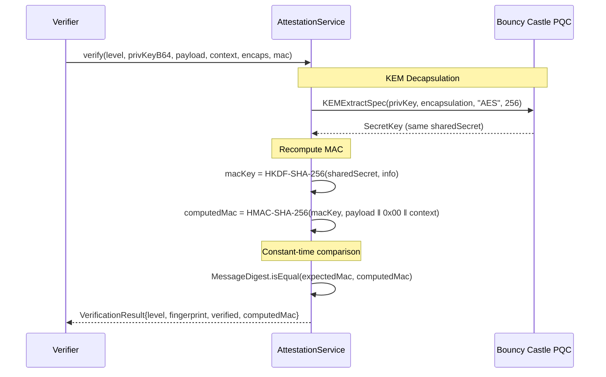

# XaihtKyber

[](https://www.oracle.com/java/)
[](https://maven.apache.org/)
[](https://jakarta.ee/)
[](https://www.bouncycastle.org/)
[](./LICENSE)

**XaihtKyber** is a production-oriented Java web application that exposes [CRYSTALS-Kyber](https://pq-crystals.org/kyber/) post-quantum cryptographic operations through a Jakarta Servlet + JSP interface. It is built as a Maven WAR, backed by Bouncy Castle's PQC provider, and deployable to any Jakarta EE 10 Web Profile server (GlassFish 7, Payara 6, etc.).

> **Post-Quantum Significance**: CRYSTALS-Kyber (ML-KEM) was selected by NIST in 2022 as the primary standard for post-quantum key encapsulation. Classical key-exchange algorithms (RSA, ECDH) are vulnerable to Shor's algorithm running on cryptographically relevant quantum computers. Kyber replaces those key-exchange primitives with lattice-based hardness assumptions that resist both classical and quantum attacks.

---

## Table of Contents

- [What It Does](#what-it-does)
- [Project Structure](#project-structure)
  - [Architecture Overview](#architecture-overview)
  - [Directory Layout](#directory-layout)
  - [Layer-by-Layer Breakdown](#layer-by-layer-breakdown)
- [How the Post-Quantum Kyber Procedures Work](#how-the-post-quantum-kyber-procedures-work)
  - [Kyber Key Generation](#1-kyber-key-generation)
  - [Kyber KEM + AES-GCM Encryption](#2-kyber-kem--aes-gcm-encryption-buffer-cipher)
  - [Kyber KEM + AES-GCM Decryption](#3-kyber-kem--aes-gcm-decryption-buffer-decipher)
  - [Kyber Attestation (Integrity Binding)](#4-kyber-attestation-integrity-binding)
  - [Kyber Attestation Verification](#5-kyber-attestation-verification)
  - [Cryptographic Design Decisions](#cryptographic-design-decisions)
- [Integrating XaihtKyber Into Your Own Projects](#integrating-xaihtkyber-into-your-own-projects)
  - [What You Can Reuse](#what-you-can-reuse)
  - [Step 1 – Add Dependencies](#step-1--add-dependencies)
  - [Step 2 – Copy the Reusable Packages](#step-2--copy-the-reusable-packages)
  - [Step 3 – Generate Keys](#step-3--generate-keys)
  - [Step 4 – Encrypt Data](#step-4--encrypt-data)
  - [Step 5 – Decrypt Data](#step-5--decrypt-data)
  - [Step 6 – Attest Payload Integrity](#step-6--attest-payload-integrity)
  - [Step 7 – Verify an Attestation](#step-7--verify-an-attestation)
  - [Standalone Java Usage (No Jakarta EE)](#standalone-java-usage-no-jakarta-ee)
  - [Spring Boot Integration](#spring-boot-integration)
  - [Serializing Envelopes for Wire Transfer](#serializing-envelopes-for-wire-transfer)
  - [Key Storage Recommendations](#key-storage-recommendations)
- [Prerequisites](#prerequisites)
- [Build and Test](#build-and-test)
- [Running the Application](#running-the-application)
  - [GlassFish 7 Deployment](#glassfish-7-deployment)
  - [Docker](#docker)
  - [Kubernetes](#kubernetes)
  - [Jenkins CI/CD](#jenkins-cicd)
- [Pages and Endpoints](#pages-and-endpoints)
- [Security Considerations](#security-considerations)
- [Maven Profiles](#maven-profiles)
- [Troubleshooting](#troubleshooting)
- [License](#license)

---

## What It Does

XaihtKyber provides five post-quantum cryptographic workflows via a web UI and reusable Java service classes:

| Workflow | Algorithm Stack | Description |
|---|---|---|
| **Key Generation** | CRYSTALS-Kyber (512/768/1024) | Generates X.509 public & PKCS#8 private key pairs with SHA-256 fingerprints |
| **Buffer Cipher** | Kyber KEM → AES-256-GCM | Encrypts arbitrary plaintext using a Kyber-derived session key |
| **Buffer Decipher** | Kyber KEM → AES-256-GCM | Decrypts the cipher envelope using the recipient's private key |
| **Attestation** | Kyber KEM → HKDF-SHA-256 → HMAC-SHA-256 | Binds a payload to a shared secret for receiver-authenticated integrity |
| **Verification** | Kyber KEM → HKDF-SHA-256 → HMAC-SHA-256 | Verifies the integrity attestation using the matching private key |

> **Important**: Kyber is a Key Encapsulation Mechanism (KEM), not a digital signature algorithm. The "signer/verifier" workflow implements **two-party integrity attestation** (only the holder of the matching private key can verify), not publicly verifiable digital signatures. For public signatures, use CRYSTALS-Dilithium, Falcon, or SPHINCS+.

---

## Project Structure

### Architecture Overview



The application follows a strict **three-layer architecture**:

1. **Crypto Layer** – Immutable data carriers (envelopes, key material), enums, exceptions, and the Bouncy Castle PQC provider singleton.
2. **Service Layer** – Stateless business logic for all cryptographic operations. Each service is a CDI-managed bean (`@Dependent`). This layer is **fully reusable** outside the web context.
3. **Web Layer** – Jakarta Servlet endpoints that parse HTTP form parameters, delegate to service beans, and forward to JSP views.

### Directory Layout

```text
XaihtKyber/
├── pom.xml                         # Maven build: Java 21, WAR packaging, BouncyCastle PQC
├── Dockerfile                      # Multi-stage: Maven build → Payara 6 runtime
├── Jenkinsfile                     # CI/CD pipeline: Docker rebuild + K8s redeploy
├── kubernetes-deployment.yaml      # Deployment + LoadBalancer Service (port 9595→8080)
├── LICENSE                         # GPLv3
│
└── src/
    ├── main/
    │   ├── java/com/xaiht/kyber/
    │   │   ├── crypto/                          # ← CRYPTO LAYER
    │   │   │   ├── PostQuantumProviderRegistry.java   # Singleton BC PQC provider
    │   │   │   ├── KyberSecurityLevel.java            # Enum: 512, 768, 1024
    │   │   │   ├── KyberKeyMaterial.java               # Key pair data carrier
    │   │   │   ├── CipherEnvelope.java                 # Encryption output envelope
    │   │   │   ├── AttestationEnvelope.java             # Attestation output envelope
    │   │   │   ├── VerificationResult.java              # Verification outcome
    │   │   │   ├── CryptoOperationException.java        # Crypto failure (unchecked)
    │   │   │   └── ValidationException.java             # Input validation failure (unchecked)
    │   │   │
    │   │   ├── service/                         # ← SERVICE LAYER (reusable)
    │   │   │   ├── KyberKeyService.java               # Key generation, encode/decode, fingerprint
    │   │   │   ├── KyberCipherService.java            # KEM + AES-GCM encrypt/decrypt
    │   │   │   └── KyberAttestationService.java       # KEM + HKDF + HMAC attest/verify
    │   │   │
    │   │   └── web/                             # ← WEB LAYER (servlet-specific)
    │   │       ├── BaseKyberServlet.java               # Abstract base: GET→JSP, error handling
    │   │       ├── ServletSupport.java                  # CSRF, headers, parameter validation
    │   │       ├── KeyGenerationServlet.java            # POST /keys/generate
    │   │       ├── BufferCipherServlet.java             # POST /buffer/cipher
    │   │       ├── BufferDecipherServlet.java           # POST /buffer/decipher
    │   │       ├── KyberSignerServlet.java              # POST /attestation/sign
    │   │       └── KyberSignVerifierServlet.java        # POST /attestation/verify
    │   │
    │   └── webapp/
    │       ├── index.jsp                          # Landing page
    │       ├── key-generator.jsp                  # Key generation form + results
    │       ├── buffer-cipher.jsp                  # Encrypt form + cipher envelope display
    │       ├── buffer-decipher.jsp                 # Decrypt form + plaintext recovery
    │       ├── kyber-signer.jsp                   # Attestation form + envelope display
    │       ├── kyber-sign-verifier.jsp             # Verification form + result display
    │       ├── assets/app.css                     # Application stylesheet
    │       └── WEB-INF/
    │           ├── web.xml                        # Servlet 6.0 descriptor
    │           ├── beans.xml                      # CDI 4.0 (annotated discovery)
    │           └── jspf/helpers.jspf              # XSS-safe HTML escaping helpers
    │
    └── test/java/com/xaiht/kyber/service/
        ├── KyberCipherServiceTest.java            # Round-trip cipher at all 3 levels
        └── KyberAttestationServiceTest.java       # Attestation verify + tamper rejection
```

### Layer-by-Layer Breakdown

#### Crypto Layer (`com.xaiht.kyber.crypto`)

This package contains **no business logic**. It defines:

| Class | Role |
|---|---|
| `PostQuantumProviderRegistry` | Thread-safe singleton that lazily initializes a `BouncyCastlePQCProvider`. All service classes reference this single instance to ensure consistent JCA algorithm registration. |
| `KyberSecurityLevel` | Enum mapping `Kyber-512`, `Kyber-768`, and `Kyber-1024` to their `KyberParameterSpec` constants. Supports parsing from form values (`"512"`, `"Kyber512"`, etc.) and from decoded `KyberKey` instances. |
| `KyberKeyMaterial` | Immutable data carrier for a generated key pair: security level, Base64 public key, Base64 private key, and a 12-byte hex fingerprint. |
| `CipherEnvelope` | Immutable data carrier for the output of an encryption operation: security level, recipient fingerprint, Base64 encapsulation, Base64 IV, Base64 ciphertext, and Base64 AAD. |
| `AttestationEnvelope` | Immutable data carrier for an attestation: security level, verifier fingerprint, Base64 encapsulation, Base64 MAC, and Base64 context. |
| `VerificationResult` | Immutable data carrier for a verification outcome: security level, verifier fingerprint, boolean verified flag, and the computed MAC for diagnostics. |
| `CryptoOperationException` | Unchecked exception wrapping JCA/BC failures during cryptographic operations. |
| `ValidationException` | Unchecked exception for input validation failures (missing keys, bad Base64, security level mismatch). |

#### Service Layer (`com.xaiht.kyber.service`)

This is the **core of the cryptographic logic** and is fully reusable:

| Class | Responsibility |
|---|---|
| `KyberKeyService` | Generates Kyber key pairs at any supported security level. Encodes keys to Base64, decodes from Base64/PEM, validates security level of decoded keys, and computes SHA-256 fingerprints (first 12 bytes, hex-encoded). |
| `KyberCipherService` | Performs the full KEM→AES-256-GCM encrypt/decrypt pipeline. Encapsulates a shared secret against the recipient's public key, derives a 256-bit AES key, encrypts with `AES/GCM/NoPadding` (12-byte IV, 128-bit auth tag), and returns a `CipherEnvelope`. Decryption reverses the process using `KEMExtractSpec`. |
| `KyberAttestationService` | Performs the KEM→HKDF-SHA-256→HMAC-SHA-256 attestation pipeline. Encapsulates a shared secret, derives a 256-bit MAC key via HKDF with `"XaihtKyber-Attestation|<context>"` as info, computes `HMAC-SHA-256(payload ‖ 0x00 ‖ context)`, and packages the result as an `AttestationEnvelope`. Verification uses constant-time `MessageDigest.isEqual()`. |

All services:
- Use CDI `@Dependent` scope (new instance per injection point)
- Provide a no-arg constructor for standalone (non-CDI) usage
- Wipe secret key material from byte arrays in `finally` blocks

#### Web Layer (`com.xaiht.kyber.web`)

This layer is **specific to the servlet container** and not needed for library reuse:

| Class | Responsibility |
|---|---|
| `BaseKyberServlet` | Abstract base servlet providing common patterns: `doGet` forwards to the JSP view, `forwardSuccess` returns results, `handleFailure` sets error attributes and logs. |
| `ServletSupport` | Static utilities: CSRF token generation/validation via `HttpSession`, security response headers (CSP, no-cache, X-Frame-Options, etc.), parameter extraction with validation and size limits, root-cause unwinding for exceptions. |
| `KeyGenerationServlet` | Mapped to `POST /keys/generate`. Parses security level, delegates to `KyberKeyService`, exposes `KyberKeyMaterial` to JSP. |
| `BufferCipherServlet` | Mapped to `POST /buffer/cipher`. Parses public key + plaintext + AAD, delegates to `KyberCipherService.cipher()`, exposes `CipherEnvelope` to JSP. |
| `BufferDecipherServlet` | Mapped to `POST /buffer/decipher`. Parses private key + envelope fields, delegates to `KyberCipherService.decipher()`, exposes recovered plaintext to JSP. |
| `KyberSignerServlet` | Mapped to `POST /attestation/sign`. Parses public key + payload + context, delegates to `KyberAttestationService.attest()`, exposes `AttestationEnvelope` to JSP. |
| `KyberSignVerifierServlet` | Mapped to `POST /attestation/verify`. Parses private key + payload + context + envelope, delegates to `KyberAttestationService.verify()`, exposes `VerificationResult` to JSP. |

---

## How the Post-Quantum Kyber Procedures Work

### 1. Kyber Key Generation

**Where**: `KyberKeyService.generateKeyPair()`



**What happens cryptographically**:
1. The `KeyPairGenerator` is initialized with one of three parameter sets: `kyber512`, `kyber768`, or `kyber1024`. These correspond to NIST security levels 1, 3, and 5 respectively.
2. Bouncy Castle internally samples random polynomials from a centered binomial distribution over the ring `Zq[X]/(X^256 + 1)` where `q = 3329`, constructs a public matrix via `ρ` (seed), computes `t = A·s + e`, and outputs the serialized key pair.
3. The public key is encoded in X.509 `SubjectPublicKeyInfo` DER format, and the private key in PKCS#8 `PrivateKeyInfo` DER format. Both are then Base64-encoded for transport.
4. A **fingerprint** is computed as the first 12 bytes (24 hex characters) of `SHA-256(DER-encoded public key)`, used as a human-readable key identifier in envelopes.

**Security levels explained**:

| Level | Parameter Set | NIST Security | Classical Equivalent | Public Key Size | Shared Secret |
|---|---|---|---|---|---|
| Kyber-512 | `kyber512` | Level 1 | ~AES-128 | 800 bytes | 32 bytes |
| Kyber-768 | `kyber768` | Level 3 | ~AES-192 | 1,184 bytes | 32 bytes |
| Kyber-1024 | `kyber1024` | Level 5 | ~AES-256 | 1,568 bytes | 32 bytes |

---

### 2. Kyber KEM + AES-GCM Encryption (Buffer Cipher)

**Where**: `KyberCipherService.cipher()`



**Detailed step-by-step**:

1. **Decode & Validate**: The recipient's public key is decoded from Base64/PEM and its security level is validated against the requested level.
2. **KEM Encapsulation**: Using Bouncy Castle's `KEMGenerateSpec`, a fresh 256-bit AES shared secret is encapsulated against the recipient's Kyber public key. This produces:
   - A **shared secret** (32 bytes) – used as the AES-256 key
   - An **encapsulation** (ciphertext of the KEM) – must be sent to the recipient so they can decapsulate
3. **IV Generation**: A cryptographically random 12-byte initialization vector is generated via `SecureRandom`.
4. **AES-256-GCM Encryption**: The plaintext is encrypted using `AES/GCM/NoPadding` with:
   - The 32-byte shared secret as the AES key
   - The 12-byte IV
   - A 128-bit authentication tag
   - Optional Additional Authenticated Data (AAD) for channel binding
5. **Key Wiping**: The AES key byte array is zeroed out in a `finally` block to minimize key exposure in memory.
6. **Envelope Construction**: All outputs are Base64-encoded and bundled into a `CipherEnvelope`.

---

### 3. Kyber KEM + AES-GCM Decryption (Buffer Decipher)

**Where**: `KyberCipherService.decipher()`



**Key point**: The same 32-byte shared secret is recovered by the recipient's private key through Kyber decapsulation (`KEMExtractSpec`). AES-GCM then validates both integrity (128-bit auth tag) and authenticity (AAD) before releasing the plaintext.

---

### 4. Kyber Attestation (Integrity Binding)

**Where**: `KyberAttestationService.attest()`



**Why this design**:
- Kyber cannot produce digital signatures. It is a KEM that produces a shared secret known to both parties.
- The shared secret is **not used directly** as a MAC key. Instead, it passes through **HKDF-SHA-256** (HMAC-based Key Derivation Function) with domain-separated info (`"XaihtKyber-Attestation|<context>"`) to produce a purpose-bound 256-bit MAC key.
- The MAC is computed over `payload || 0x00 || context` where `0x00` is a separator byte that prevents ambiguity between payload and context boundaries.
- This provides **receiver-authenticated integrity**: only the holder of the matching Kyber private key can verify the attestation.

---

### 5. Kyber Attestation Verification

**Where**: `KyberAttestationService.verify()`



**Security note**: The MAC comparison uses `MessageDigest.isEqual()` which performs constant-time byte comparison, preventing timing side-channel attacks.

---

### Cryptographic Design Decisions

| Decision | Rationale |
|---|---|
| **Kyber as KEM, not signatures** | Kyber is mathematically a KEM (IND-CCA2 secure). Using it outside its intended primitive would be non-standard and potentially insecure. |
| **AES-256-GCM for symmetric encryption** | Provides authenticated encryption with associated data (AEAD). The 128-bit auth tag guarantees both confidentiality and integrity. |
| **12-byte IV for GCM** | NIST SP 800-38D recommends 96-bit (12-byte) IVs for GCM. Random generation is safe for a single key use (each KEM encapsulation produces a fresh key). |
| **HKDF for key derivation** | RFC 5869 standard KDF. Domain separation via the `info` parameter prevents cross-protocol attacks. |
| **Separator byte 0x00 in HMAC input** | Prevents length-extension ambiguity: `payload="AB", context="CD"` and `payload="ABC", context="D"` produce different MAC inputs. |
| **Key material wiping** | `Arrays.fill(keyBytes, (byte) 0)` in `finally` blocks. This is a best-effort defense; the JVM may copy byte arrays during GC, but it reduces the window of exposure. |
| **BouncyCastlePQCProvider singleton** | Thread-safe, avoids repeated JCA provider registration and object creation overhead. |

---

## Integrating XaihtKyber Into Your Own Projects

### What You Can Reuse

The **crypto** and **service** packages are completely independent from the servlet container. You can drop them into any Java 21+ project:

```text
Reusable (copy these):
  com.xaiht.kyber.crypto.*     ← All files
  com.xaiht.kyber.service.*    ← All files

Not needed for library use:
  com.xaiht.kyber.web.*        ← Servlet-specific
  src/main/webapp/**           ← JSP views, CSS, web.xml
```

### Step 1 – Add Dependencies

Add Bouncy Castle PQC to your project's `pom.xml`:

```xml
<dependency>
    <groupId>org.bouncycastle</groupId>
    <artifactId>bcprov-jdk18on</artifactId>
    <version>1.78.1</version>
</dependency>
```

> **Note**: XaihtKyber uses `1.78.1.redhat-00002` from the Red Hat GA repository, but any `1.78.1+` release from Maven Central works the same way. If you do not need the Red Hat certified build, just use the upstream version.

Your project must target **Java 21 or newer**:

```xml
<properties>
    <maven.compiler.release>21</maven.compiler.release>
</properties>
```

### Step 2 – Copy the Reusable Packages

Copy these packages into your source tree (adjust the package namespace if needed):

```text
com/xaiht/kyber/crypto/
    PostQuantumProviderRegistry.java
    KyberSecurityLevel.java
    KyberKeyMaterial.java
    CipherEnvelope.java
    AttestationEnvelope.java
    VerificationResult.java
    CryptoOperationException.java
    ValidationException.java

com/xaiht/kyber/service/
    KyberKeyService.java
    KyberCipherService.java
    KyberAttestationService.java
```

> **CDI annotations are optional**: The service classes use `@Dependent` and `@Inject` from Jakarta CDI, but they also provide **no-arg constructors** for plain Java instantiation. If your project does not use CDI, you can either remove the annotations or simply ignore them — they have no effect without a CDI container.

### Step 3 – Generate Keys

```java
import com.xaiht.kyber.crypto.KyberKeyMaterial;
import com.xaiht.kyber.crypto.KyberSecurityLevel;
import com.xaiht.kyber.service.KyberKeyService;

// Create service (no CDI container needed)
KyberKeyService keyService = new KyberKeyService();

// Generate a Kyber-1024 key pair
KyberKeyMaterial keys = keyService.generateKeyPair(KyberSecurityLevel.KYBER_1024);

// Access the outputs
String publicKeyBase64  = keys.getPublicKeyBase64();   // Share with senders
String privateKeyBase64 = keys.getPrivateKeyBase64();  // Keep secret!
String fingerprint      = keys.getKeyFingerprint();    // e.g. "a3f2b9c10e4d..."

System.out.println("Security Level: " + keys.getSecurityLevel().getDisplayName());
System.out.println("Fingerprint:    " + fingerprint);
System.out.println("Public Key:     " + publicKeyBase64.substring(0, 40) + "...");
```

### Step 4 – Encrypt Data

```java
import com.xaiht.kyber.crypto.CipherEnvelope;
import com.xaiht.kyber.service.KyberCipherService;

KyberCipherService cipherService = new KyberCipherService();

// Encrypt a message for the recipient (you need their public key)
CipherEnvelope envelope = cipherService.cipher(
    KyberSecurityLevel.KYBER_1024,
    recipientPublicKeyBase64,  // Recipient's public key
    "This is classified information.",  // Plaintext
    "tenant=finance;channel=secure"     // Additional Authenticated Data (AAD)
);

// Send all five envelope fields to the recipient:
String encapsulation = envelope.getEncapsulationBase64();     // Kyber KEM ciphertext
String iv            = envelope.getInitializationVectorBase64(); // 12-byte IV
String ciphertext    = envelope.getCipherTextBase64();         // AES-GCM ciphertext
String aad           = envelope.getAadBase64();                // AAD (bound, not encrypted)
String fingerprint   = envelope.getRecipientFingerprint();     // For key selection
```

### Step 5 – Decrypt Data

```java
// On the recipient's side (they have the matching private key)
String plaintext = cipherService.decipher(
    KyberSecurityLevel.KYBER_1024,
    recipientPrivateKeyBase64,   // Recipient's private key
    envelope.getEncapsulationBase64(),
    envelope.getInitializationVectorBase64(),
    envelope.getCipherTextBase64(),
    envelope.getAadBase64()
);

System.out.println(plaintext);  // "This is classified information."
```

### Step 6 – Attest Payload Integrity

```java
import com.xaiht.kyber.crypto.AttestationEnvelope;
import com.xaiht.kyber.service.KyberAttestationService;

KyberAttestationService attestationService = new KyberAttestationService();

// Create an attestation that only the verifier (private key holder) can validate
AttestationEnvelope attest = attestationService.attest(
    KyberSecurityLevel.KYBER_768,
    verifierPublicKeyBase64,          // Verifier's public key
    "{\"approved\": true, \"amount\": 50000}",  // Payload to protect
    "transaction-id-9f3c"              // Context / scope identifier
);

// Send to verifier: attest.getEncapsulationBase64(), attest.getMacBase64()
```

### Step 7 – Verify an Attestation

```java
import com.xaiht.kyber.crypto.VerificationResult;

// On the verifier's side
VerificationResult result = attestationService.verify(
    KyberSecurityLevel.KYBER_768,
    verifierPrivateKeyBase64,          // Verifier's private key
    "{\"approved\": true, \"amount\": 50000}",  // Original payload
    "transaction-id-9f3c",             // Original context
    attest.getEncapsulationBase64(),
    attest.getMacBase64()
);

if (result.isVerified()) {
    System.out.println("✓ Payload integrity confirmed.");
} else {
    System.out.println("✗ Payload has been tampered with!");
}
```

### Standalone Java Usage (No Jakarta EE)

The services work without any application server. Here's a complete standalone example:

```java
import com.xaiht.kyber.crypto.*;
import com.xaiht.kyber.service.*;

public class KyberDemo {
    public static void main(String[] args) {
        KyberKeyService keyService = new KyberKeyService();
        KyberCipherService cipherService = new KyberCipherService(keyService);
        KyberAttestationService attestService = new KyberAttestationService(keyService);

        // --- Encryption round-trip ---
        KyberKeyMaterial keys = keyService.generateKeyPair(KyberSecurityLevel.KYBER_1024);

        CipherEnvelope encrypted = cipherService.cipher(
            KyberSecurityLevel.KYBER_1024,
            keys.getPublicKeyBase64(),
            "Hello, post-quantum world!",
            ""
        );

        String decrypted = cipherService.decipher(
            KyberSecurityLevel.KYBER_1024,
            keys.getPrivateKeyBase64(),
            encrypted.getEncapsulationBase64(),
            encrypted.getInitializationVectorBase64(),
            encrypted.getCipherTextBase64(),
            encrypted.getAadBase64()
        );

        assert "Hello, post-quantum world!".equals(decrypted);

        // --- Attestation round-trip ---
        AttestationEnvelope attestation = attestService.attest(
            KyberSecurityLevel.KYBER_1024,
            keys.getPublicKeyBase64(),
            "critical-data",
            "context-v1"
        );

        VerificationResult verified = attestService.verify(
            KyberSecurityLevel.KYBER_1024,
            keys.getPrivateKeyBase64(),
            "critical-data",
            "context-v1",
            attestation.getEncapsulationBase64(),
            attestation.getMacBase64()
        );

        assert verified.isVerified();
        System.out.println("All post-quantum operations completed successfully.");
    }
}
```

### Spring Boot Integration

If your project uses Spring Boot instead of Jakarta EE, register the services as beans:

```java
import org.springframework.context.annotation.Bean;
import org.springframework.context.annotation.Configuration;

import com.xaiht.kyber.service.*;

@Configuration
public class KyberConfiguration {

    @Bean
    public KyberKeyService kyberKeyService() {
        return new KyberKeyService();
    }

    @Bean
    public KyberCipherService kyberCipherService(KyberKeyService keyService) {
        return new KyberCipherService(keyService);
    }

    @Bean
    public KyberAttestationService kyberAttestationService(KyberKeyService keyService) {
        return new KyberAttestationService(keyService);
    }
}
```

Then inject them anywhere:

```java
@RestController
public class SecureMessageController {

    @Autowired
    private KyberCipherService cipherService;

    @PostMapping("/encrypt")
    public CipherEnvelope encrypt(@RequestBody EncryptRequest req) {
        return cipherService.cipher(
            KyberSecurityLevel.fromFormValue(req.level()),
            req.publicKey(),
            req.plaintext(),
            req.aad()
        );
    }
}
```

### Serializing Envelopes for Wire Transfer

The envelope classes are plain POJOs. For JSON serialization (REST APIs, message queues), use Jackson or Gson:

```java
// Jackson example
ObjectMapper mapper = new ObjectMapper();

// Serialize
String json = mapper.writeValueAsString(cipherEnvelope);

// Deserialize (you'll need a @JsonCreator or a custom deserializer
// since the classes use constructor injection)
```

For production APIs, consider creating DTOs or records that mirror the envelope fields:

```java
public record CipherEnvelopeDto(
    String securityLevel,
    String recipientFingerprint,
    String encapsulation,
    String initializationVector,
    String cipherText,
    String aad
) {
    public static CipherEnvelopeDto from(CipherEnvelope env) {
        return new CipherEnvelopeDto(
            env.getSecurityLevel().getFormValue(),
            env.getRecipientFingerprint(),
            env.getEncapsulationBase64(),
            env.getInitializationVectorBase64(),
            env.getCipherTextBase64(),
            env.getAadBase64()
        );
    }
}
```

### Key Storage Recommendations

| Environment | Public Key Storage | Private Key Storage |
|---|---|---|
| Development | File system, database, in-memory | File system (restricted permissions), environment variable |
| Staging | Database, config map | HashiCorp Vault, AWS Secrets Manager, Azure Key Vault |
| Production | Database, distributed config | HSM, KMS, Vault with audit logging |

**Critical rules**:
- Never log private keys
- Never transmit private keys over unencrypted channels
- Rotate key pairs periodically (Kyber key generation is fast: ~1ms for Kyber-1024)
- Store the `keyFingerprint` alongside keys for correlation

---

## Prerequisites

| Component | Required | Why |
|---|---|---|
| JDK | Java 21+ | `pom.xml` enforces `maven.compiler.release=21` with `maven-enforcer-plugin` |
| Maven | 3.9+ recommended | No Maven Wrapper included in this repo |
| Application server | GlassFish 7 or Payara 6 | Jakarta EE 10 Web Profile: Servlet 6.0, CDI 4.0, JSP |

> **Important**: Use a JDK, not a JRE. The project compiles source code and uses `javac`.

---

## Build and Test

### Verify your toolchain

```powershell
java -version       # Must show 21+
javac -version      # Must be present (JDK, not JRE)
mvn -version        # Must be available on PATH
```

### Build and run tests

```powershell
mvn clean test
```

This runs:
- Cipher/decipher round-trip tests across Kyber-512, Kyber-768, Kyber-1024
- Attestation verify + tamper rejection tests

### Build the deployable WAR

```powershell
mvn clean package
```

Output: `target/XaihtKyber.war`

---

## Running the Application

### GlassFish 7 Deployment

**Option A – GlassFish autodeploy (manual)**:

```powershell
mvn clean package
Copy-Item .\target\XaihtKyber.war "C:\path\to\glassfish7\glassfish\domains\domain1\autodeploy\"
```

**Option B – Maven auto-deploy profile**:

```powershell
$env:GLASSFISH_HOME = "C:\glassfish7"
mvn clean install -Pauto-deploy
```

**Option C – asadmin**:

```powershell
C:\glassfish7\bin\asadmin.bat start-domain domain1
C:\glassfish7\bin\asadmin.bat deploy --force=true .\target\XaihtKyber.war
```

Open: `http://localhost:8080/XaihtKyber/`

### Docker

```powershell
docker build -t xaiht-kyber:latest .
docker run --rm -p 8080:8080 xaiht-kyber:latest
```

Open: `http://localhost:8080/XaihtKyber/`

The Dockerfile uses a multi-stage build: `maven:3.9.11-eclipse-temurin-21` for compilation, `payara/server-web:6.2025.11-jdk21` for runtime.

### Kubernetes

```powershell
docker build -t xaiht-kyber:latest .
kubectl apply -f kubernetes-deployment.yaml
kubectl rollout status deployment/xaiht-kyber-deployment
```

- **Service port**: 9595
- **Container port**: 8080
- **Context path**: `/XaihtKyber/`
- Includes startup, readiness, and liveness probes

### Jenkins CI/CD

The `Jenkinsfile` provides a full Windows-oriented pipeline:

1. Cleans old Kubernetes resources
2. Removes old Docker containers/images
3. Builds fresh Docker image
4. Runs container locally
5. Applies Kubernetes manifest
6. Polls deployment readiness with diagnostics on timeout

**Agent requirements**: Windows, Docker, `kubectl`, access to Docker daemon and Kubernetes cluster.

---

## Pages and Endpoints

| Page | Purpose | POST Endpoint |
|---|---|---|
| `/index.jsp` | Landing page with overview | — |
| `/key-generator.jsp` | Generate Kyber key pairs | `POST /keys/generate` |
| `/buffer-cipher.jsp` | Encrypt plaintext → cipher envelope | `POST /buffer/cipher` |
| `/buffer-decipher.jsp` | Decrypt cipher envelope → plaintext | `POST /buffer/decipher` |
| `/kyber-signer.jsp` | Generate integrity attestation | `POST /attestation/sign` |
| `/kyber-sign-verifier.jsp` | Verify integrity attestation | `POST /attestation/verify` |

---

## Security Considerations

### Response Headers

`ServletSupport` applies on every response:

| Header | Value |
|---|---|
| `Cache-Control` | `no-store, no-cache, must-revalidate, max-age=0` |
| `Pragma` | `no-cache` |
| `Expires` | `0` |
| `X-Content-Type-Options` | `nosniff` |
| `Content-Security-Policy` | `default-src 'self'; style-src 'self' 'unsafe-inline'; form-action 'self'; base-uri 'self'` |
| `Referrer-Policy` | `no-referrer` |
| `X-Frame-Options` | `DENY` |

### Input Validation

- CSRF token required on every POST (session-bound UUID)
- Security level validated against the actual decoded key's parameter set
- Size limits on all text inputs (max 256 KB for plaintext, 32 KB for keys)
- Base64 format validation on all envelope fields
- PEM header/footer stripping for key inputs (supports both raw Base64 and PEM)
- IV must decode to exactly 12 bytes

### XSS Prevention

All JSP output uses the `h()` helper function from `helpers.jspf`, which escapes `&`, `<`, `>`, `"`, and `'`.

---

## Maven Profiles

| Profile | Phase | Purpose |
|---|---|---|
| `auto-clean` | clean | Explicit `target/` cleanup |
| `auto-deploy` | install | Copy WAR to GlassFish autodeploy directory |
| `dependency-check` | verify | Run OWASP Dependency-Check (set `NVD_API_KEY` env var for faster scans) |
| `launch-report` | verify | Open the dependency-check HTML report (Windows/PowerShell only) |

```powershell
# Dependency audit
mvn verify -Pdependency-check

# Audit + auto-open report
mvn verify -Pdependency-check,launch-report
```

---

## Troubleshooting

| Problem | Likely Cause | Solution |
|---|---|---|
| `mvn clean package` fails with Java version error | JDK < 21 or `JAVA_HOME` pointing to a JRE | Install JDK 21+, set `JAVA_HOME` correctly |
| Builds but fails to deploy | Server lacks CDI, JSP, or Jakarta EE 10 APIs | Use GlassFish 7, Payara 6, or equivalent Jakarta EE 10 Web Profile server |
| `auto-deploy` profile can't find GlassFish | `GLASSFISH_HOME` wrong or domain doesn't exist | Point to installation root (e.g., `C:\glassfish7`, not `C:\glassfish7\glassfish`) |
| K8s pod not reachable | Image not accessible to cluster, or service port vs context path confusion | Push image to registry, access via `<service-ip>:9595/XaihtKyber/` |
| Decryption fails with correct-looking values | Security level mismatch, wrong key, modified AAD, or IV not exactly 12 bytes | Ensure end-to-end consistency of all envelope fields |
| Verification fails | Payload or context text doesn't match original (even whitespace matters) | Re-enter exact original values; note that the UI displays context as Base64 but verification expects raw text |
| Jenkins pipeline timeout | Payara startup + image pull exceeds rollout timeout | Increase `K8S_ROLLOUT_TIMEOUT_SECONDS` in Jenkinsfile |

---

## License

This project is licensed under the [GNU General Public License v3.0](./LICENSE).
